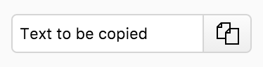

# clipboard-input [](https://travis-ci.org/jshcrowthe/clipboard-input)

An element providing a copiable input field for a given value.

## Example

```html
<clipboard-input value='Text to be copied'></clipboard-input>
```

Output:


